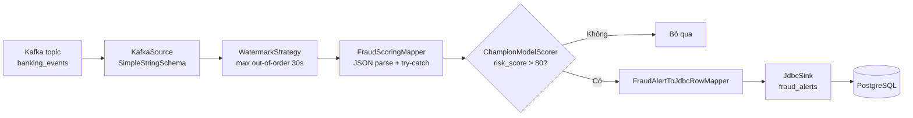
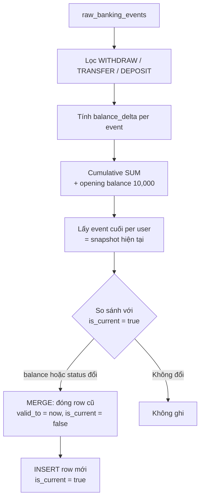

# Tầng 3: Processing Layer — Hướng dẫn Luồng Dữ Liệu & Debug

Tài liệu này mô tả hai luồng xử lý độc lập của Banking Fraud Detection:

| Luồng | File | Công nghệ | Nguồn | Đích |
|-------|------|-----------|-------|------|
| Real-time | `streaming_layer/fraud_detector.py` | PyFlink DataStream | Kafka `banking_events` | PostgreSQL `fraud_alerts` |
| Micro-batch | `batch_layer/jobs/process_account_scd.py` | PySpark + Iceberg | `local.raw.raw_banking_events` | `local.dim.account_history` |

---

## 1. Luồng Real-time — PyFlink (`fraud_detector.py`)

### 1.1 Dòng chảy dữ liệu



**Chi tiết từng bước:**

1. **KafkaSource** đọc liên tục topic `banking_events` (JSON string). Offset khởi đầu: `latest()` — chỉ nhận event mới sau khi job chạy.
2. **WatermarkStrategy** gán watermark processing-time với độ trễ tối đa `WATERMARK_MAX_OUT_OF_ORDER_SEC` (mặc định 30 giây). Dùng khi mở rộng sang event-time window.
3. **FraudScoringMapper** parse JSON (`parse_banking_event`). Lỗi JSON → log warning + `print [PARSE ERROR]`, message bị bỏ qua (không làm crash job).
4. **ChampionModelScorer** (placeholder) random `risk_score` 0–100. Nếu > 80 → fraud. In log `[RECEIVED]`, `[SCORE]`, `[FRAUD]`.
5. **JdbcSink** batch INSERT vào `fraud_alerts`. `risk_score` lưu dạng 0–1 (chia 100) theo constraint schema PostgreSQL.

### 1.2 Checkpoint & xử lý late events

Cấu hình trong `configure_environment()`:

| Biến môi trường | Mặc định | Ý nghĩa |
|-----------------|----------|---------|
| `FLINK_CHECKPOINT_INTERVAL_MS` | `60000` | Chu kỳ checkpoint (ms) |
| `FLINK_WATERMARK_MAX_OUT_OF_ORDER_SEC` | `30` | Cho phép event "trễ" tối đa trước khi watermark tiến |

**Khi dữ liệu bị trễ (late events):**

1. **Tăng watermark tolerance** — chạy job với:
   ```cmd
   set FLINK_WATERMARK_MAX_OUT_OF_ORDER_SEC=120
   python streaming_layer/fraud_detector.py
   ```
2. **Giảm checkpoint interval** nếu cần recovery nhanh hơn:
   ```cmd
   set FLINK_CHECKPOINT_INTERVAL_MS=30000
   ```
3. **Event-time watermark** (nâng cao): mở rộng `FraudScoringMapper` để emit `TimestampAssigner` từ field `timestamp` JSON thay vì processing-time.
4. **Allowed lateness trên Window** (khi thêm window aggregation):
   ```python
   stream.key_by(...).window(TumblingEventTimeWindows.of(Time.minutes(5))) \
       .allowed_lateness(Time.seconds(60)) \
       .side_output_late_data(late_tag)
   ```
   Event quá trễ → side output → ghi bảng `fraud_alerts_late` hoặc dead-letter Kafka topic.

### 1.3 Debug Flink trên terminal

Log in ra console theo prefix:

```
[STARTUP]  — job khởi động, in kafka/postgres endpoint
[RECEIVED] — đã nhận event X
[SCORE]    — event không phải fraud
[FRAUD]    — đã phát hiện gian lận
[PARSE ERROR] — JSON hỏng
```

Kiểm tra PostgreSQL sau khi chạy:

```sql
SELECT user_id, source_event_id, risk_score, risk_level, detected_at
FROM fraud_alerts
ORDER BY detected_at DESC
LIMIT 20;
```

---

## 2. Luồng Micro-batch — PySpark SCD Type 2 (`process_account_scd.py`)

### 2.1 Thuật toán SCD Type 2



**Công thức balance:**

```
balance_delta = CASE
  WHEN event_type IN ('WITHDRAW','TRANSFER') THEN -amount
  WHEN event_type = 'DEPOSIT'               THEN +amount
  ELSE 0
END

running_balance = 10_000 + SUM(balance_delta)
  OVER (PARTITION BY user_id ORDER BY event_timestamp, event_id
        ROWS BETWEEN UNBOUNDED PRECEDING AND CURRENT ROW)
```

**Snapshot hiện tại** = `running_balance` tại event cuối cùng của mỗi `user_id`.

**SCD merge (2 pha)** — module `batch_layer/modules/account_history_scd.py`:

| Pha | Hành động | Điều kiện |
|-----|-----------|-----------|
| MERGE UPDATE | Đóng bản ghi cũ | `target.is_current = true` AND (`balance` hoặc `account_status` khác snapshot) |
| INSERT | Thêm phiên bản mới | Không còn dòng current khớp snapshot (account mới hoặc vừa đóng) |

Mỗi phiên bản mới có `valid_from = current_timestamp()`, `valid_to = NULL`, `is_current = true`.

### 2.2 MLOps — `evaluate_models(df)`

Hàm thêm 2 cột song song:

- `champion_is_fraud` — rule amount/event_type (placeholder)
- `challenger_is_fraud` — rule IP + amount (placeholder)

Kết quả append vào `local.dim.model_evaluation_staging` để đối chiếu disagreement offline.

### 2.3 Debug khi số dư tính sai

**Bước 1 — Audit trail theo user:**

```cmd
set DEBUG_USER_ID=normal_user_1234
spark-submit --packages org.apache.iceberg:iceberg-spark-runtime-3.3_2.12:1.4.3 batch_layer/jobs/process_account_scd.py
```

In bảng: `user_id | event_id | event_type | amount | balance_delta | running_balance | event_timestamp`

**Bước 2 — Audit toàn bộ:**

```cmd
set DEBUG_BALANCE_AUDIT=true
spark-submit ...
```

**Bước 3 — Kiểm tra SCD timeline:**

```sql
-- Spark SQL
SELECT account_id, balance, account_status, valid_from, valid_to, is_current, source_event_id
FROM local.dim.account_history
WHERE user_id = 'normal_user_1234'
ORDER BY valid_from;
```

**Nguyên nhân thường gặp:**

| Triệu chứng | Nguyên nhân | Cách sửa |
|-------------|-------------|----------|
| Balance quá thấp | Thiếu opening balance | Kiểm tra `DEFAULT_OPENING_BALANCE` |
| Balance âm | WITHDRAW/TRANSFER không trừ đúng | Xem `balance_delta` trong audit |
| Nhiều row `is_current=true` | Merge lỗi / chạy song song | Chỉ chạy 1 job instance; verify MERGE SQL |
| User không có trong dim | Chỉ có LOGIN/VIEW_BALANCE | User vẫn được tạo với opening balance 10,000 |

---

## 3. Hướng dẫn chạy Local (Windows CMD)

### 3.1 Tiên quyết

```cmd
cd C:\Users\PC\banking_fraud_data_platform
docker compose up -d
```

Đảm bảo các service healthy: `kafka`, `postgres`, `flink-jobmanager`, `flink-taskmanager`, `spark-master`.

### 3.2 Sinh dữ liệu Kafka (Layer 1)

```cmd
pip install confluent-kafka
python data_generation\generate_clickstream.py
```

### 3.3 Luồng Real-time — PyFlink

**Cách A — Trong Docker Flink (khuyến nghị):**

```cmd
docker cp streaming_layer\fraud_detector.py flink-jobmanager:/tmp/fraud_detector.py

docker exec -e KAFKA_BOOTSTRAP_SERVERS=kafka:29092 ^
  -e POSTGRES_HOST=postgres ^
  -e POSTGRES_USER=admin ^
  -e POSTGRES_PASSWORD=admin123 ^
  flink-jobmanager ./bin/flink run -py /tmp/fraud_detector.py
```

Theo dõi log:

```cmd
docker logs -f flink-taskmanager
```

**Cách B — Local Python (cần cài PyFlink + JAR connectors):**

```cmd
pip install apache-flink==1.19.0 psycopg2-binary

set KAFKA_BOOTSTRAP_SERVERS=localhost:9092
set POSTGRES_HOST=localhost
set POSTGRES_PASSWORD=admin123

python streaming_layer\fraud_detector.py
```

> Flink JDBC sink cần JAR `flink-connector-jdbc` và `postgresql` driver trên classpath. Docker image `flink:1.19` thường cần thêm connector qua `FLINK_PROPERTIES` hoặc mount JAR vào `lib/`.

### 3.4 Luồng Micro-batch — PySpark

**Khởi tạo bảng Iceberg (lần đầu):**

```cmd
docker exec spark-master spark-submit ^
  --packages org.apache.iceberg:iceberg-spark-runtime-3.3_2.12:1.4.3 ^
  /app/batch_layer/jobs/init_iceberg_tables.py
```

**Ingest raw events vào Iceberg** (nếu chưa có pipeline ingest — insert thủ công hoặc job ingest riêng).

**Chạy SCD job:**

```cmd
docker exec spark-master spark-submit ^
  --packages org.apache.iceberg:iceberg-spark-runtime-3.3_2.12:1.4.3 ^
  /app/batch_layer/jobs/process_account_scd.py
```

**Chạy local (Spark standalone trên Windows):**

```cmd
set ICEBERG_WAREHOUSE=C:\Users\PC\banking_fraud_data_platform\batch_layer\warehouse

spark-submit --packages org.apache.iceberg:iceberg-spark-runtime-3.3_2.12:1.4.3 ^
  batch_layer\jobs\process_account_scd.py
```

### 3.5 Kiểm tra kết quả end-to-end

```cmd
docker exec -it postgres psql -U admin -d banking_mlops -c "SELECT COUNT(*) FROM fraud_alerts;"
```

```cmd
docker exec spark-master spark-sql --packages org.apache.iceberg:iceberg-spark-runtime-3.3_2.12:1.4.3 ^
  -e "SELECT * FROM local.dim.account_history WHERE is_current = true LIMIT 10;"
```

---

## 4. Biến môi trường tổng hợp

### Flink (`fraud_detector.py`)

| Biến | Mặc định |
|------|----------|
| `KAFKA_BOOTSTRAP_SERVERS` | `localhost:9092` |
| `KAFKA_TOPIC` | `banking_events` |
| `KAFKA_GROUP_ID` | `flink-fraud-detector` |
| `POSTGRES_HOST` | `localhost` |
| `POSTGRES_PORT` | `5432` |
| `POSTGRES_DB` | `banking_mlops` |
| `POSTGRES_USER` | `admin` |
| `POSTGRES_PASSWORD` | `admin123` |
| `FRAUD_RISK_THRESHOLD` | `80` |
| `FLINK_CHECKPOINT_INTERVAL_MS` | `60000` |
| `FLINK_WATERMARK_MAX_OUT_OF_ORDER_SEC` | `30` |

### Spark (`process_account_scd.py`)

| Biến | Mặc định |
|------|----------|
| `ICEBERG_WAREHOUSE` | `batch_layer/warehouse` |
| `DEBUG_USER_ID` | (không set) — audit 1 user |
| `DEBUG_BALANCE_AUDIT` | `true` — audit toàn bộ |
